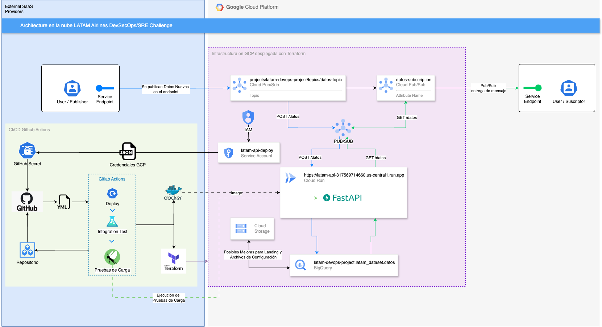

# 🚀 LATAM Airlines DevSecOps/SRE Challenge

## ✨ Descripción del Proyecto
Este proyecto implementa un sistema en la nube para ingestar, almacenar y exponer datos a través de una API HTTP para que puedan ser consumidos por terceros, utilizando infraestructura como código (IaC) con Terraform y flujos de CI/CD con GitHub Actions. Además, se incorporaron pruebas de integración, carga, monitoreo y propuestas de alertas para garantizar la resiliencia y escalabilidad del sistema.

---
## 📂 Parte 0: Estructura del Proyecto

```plaintext
📦 latam-challenge/
├── 📂 .github/
│   └── 📄 workflows/
│       └── 📄 ci-cd-pipeline.yml
├── 📂 terraform/
│   ├── 📄 main.tf
│   ├── 📄 variables.tf
│   ├── 📄 outputs.tf
│   └── 📄 provider.tf
├── 📂 app/
│   ├── 📄 main.py
│   ├── 📄 requirements.txt
│   └── 📂 tests/
│       ├── 📄 test_api.py
│       └── 📄 test_integration.py
├── 📂 load_tests/
│   └── 📄 locustfile.py
├── 📂 docs/
│   └── 📄 Arquitectura-API-Latam.png
├── 📄 Dockerfile
├── 📄 .gitignore
├── 📄 README.md
└── 📄 load-challenge.py


## 🏗️ Parte 1: Infraestructura e IaC

### **1. Identificar la infraestructura necesaria para ingestar, almacenar y exponer datos**

#### **1.1 Ingesta, almacenamiento y exposición de datos**

##### **1.1.a Utilizar el esquema Pub/Sub para ingesta de datos**
El sistema implementa un esquema de mensajería asíncrona utilizando **Google Cloud Pub/Sub** para garantizar la ingesta eficiente de datos. La arquitectura incluye:

- **Tópico:** `datos-topic`
  - Este tópico recibe los mensajes publicados por el sistema o usuarios externos.
  - Ejemplo de mensaje publicado:
    ```json
    {
      "id": "123",
      "contenido": "Este es un mensaje de prueba",
      "timestamp": "2025-01-14T10:00:00Z"
    }
    ```

- **Suscripción:** `datos-subscription`
  - Procesa los mensajes del tópico y envía los datos para su almacenamiento en BigQuery.

**Ventajas del esquema Pub/Sub:**
- Desacopla la producción y el consumo de datos, lo que facilita la escalabilidad.
- Proporciona resiliencia ante fallos temporales.
- Admite altos volúmenes de datos de manera eficiente.

##### **1.1.b Base de datos para el almacenamiento enfocado en analítica de datos**
Se utiliza **Google BigQuery** como base de datos principal para almacenar los datos. 

- **Dataset:** `latam_dataset`
- **Tabla:** `datos`
  - Esquema definido:
    ```json
    [
      {
        "name": "id",
        "type": "STRING",
        "mode": "REQUIRED",
        "description": "Identificador único del dato"
      },
      {
        "name": "contenido",
        "type": "STRING",
        "mode": "NULLABLE",
        "description": "Contenido del dato"
      },
      {
        "name": "timestamp",
        "type": "TIMESTAMP",
        "mode": "REQUIRED",
        "description": "Marca de tiempo del registro"
      }
    ]
    ```

**Beneficios de BigQuery:**
- Es ideal para tareas analíticas debido a su alta velocidad de consulta.
- Escalabilidad automática para grandes volúmenes de datos.
- Fácil integración con otros servicios de GCP.

##### **1.1.c Endpoint HTTP para servir parte de los datos almacenados**
Se implementó una API utilizando **FastAPI** desplegada en **Google Cloud Run**. Esta API expone los datos almacenados en BigQuery y ofrece dos endpoints principales:

- **Endpoint `/health`:** 
  - Devuelve el estado del sistema.
  - Ejemplo de respuesta:
    ```json
    {
      "status": "ok"
    }
    ```

- **Endpoint `/datos`:**
  - Devuelve los últimos 10 registros almacenados en BigQuery.
  - Ejemplo de respuesta:
    ```json
    {
      "datos": [
        {
          "id": "789",
          "contenido": "Prueba automática",
          "timestamp": "2024-01-14T14:00:00+00:00"
        }
      ]
    }
    ```

---

#### **1.2 Deployar infraestructura mediante Terraform**

Se utilizó **Terraform** para automatizar la creación y gestión de la infraestructura en Google Cloud Platform. Los recursos desplegados incluyen:

- **Google Cloud Pub/Sub:**
  - Tópico: `datos-topic`
  - Suscripción: `datos-subscription`

- **Google BigQuery:**
  - Dataset: `latam_dataset`
  - Tabla: `datos`

- **Google Cloud Run:**
  - API desplegada para exposición de datos.

---
## 🔄 Parte 2: Aplicaciones y flujo CI/CD

### **2.1 API HTTP**

La API HTTP fue desarrollada utilizando **FastAPI** para garantizar un alto rendimiento y facilidad de implementación. Los endpoints principales permiten la exposición de datos almacenados en la base de datos.

#### **Endpoints implementados:**
- **GET `/health`:** 
  - Verifica la salud de la API y confirma que está operativa.
  - **Respuesta de ejemplo:**
    ```json
    {
      "status": "ok"
    }
    ```

- **GET `/datos`:**
  - Recupera los últimos registros almacenados en **Google BigQuery**.
  - **Respuesta de ejemplo:**
    ```json
    {
      "datos": [
        {
          "id": "789",
          "contenido": "Prueba automática",
          "timestamp": "2024-01-14T14:00:00+00:00"
        }
      ]
    }
    ```

**Lógica implementada:**
- Conexión directa con **Google BigQuery** utilizando su cliente oficial de Python.
- Queries optimizadas para limitar los resultados y garantizar baja latencia.

---

### **2.2 Deployar API HTTP mediante CI/CD**

El despliegue de la API HTTP se realiza utilizando un flujo de **CI/CD con GitHub Actions**. Este pipeline automatiza los pasos de construcción, prueba y despliegue en **Google Cloud Run**.

#### **2.2.1 Flujo del pipeline CI/CD:**
1. **Build Docker Image:**
   - Construcción de la imagen Docker de la API.
   - Push de la imagen a **Google Container Registry (GCR)**.

2. **Deploy con Terraform:**
   - Terraform aplica los cambios para actualizar la infraestructura, incluyendo el despliegue de la API en **Google Cloud Run**.

3. **Pruebas Automáticas:**
   - Pruebas de integración y carga para validar los endpoints `/health` y `/datos`.

##### **Archivo GitHub Actions (`.github/workflows/deploy.yml`):**


### 📦 Evidencias
- Pipeline exitoso: Logs de GitHub Actions.
https://github.com/fernachbauer/latam-challenge/actions/runs/12771103343

---
### **2.3 (Opcional) Ingesta de datos desde Pub/Sub**

En esta etapa opcional, se implementó una lógica para procesar los mensajes recibidos en **Google Cloud Pub/Sub** y almacenarlos en la base de datos **Google BigQuery**.

#### **Objetivo:**
- Configurar una suscripción a **Pub/Sub** que permita:
  1. Recibir mensajes publicados en el tópico `datos-topic`.
  2. Procesar y validar los datos.
  3. Almacenar los datos recibidos en la tabla `datos` del dataset `latam_dataset` en **BigQuery**.


#### **Flujo del procesamiento:**

1. **Publicación de datos:**
   - Los datos son enviados al tópico `datos-topic` mediante el cliente de **Pub/Sub**.

2. **Procesamiento de mensajes:**
   - Se configura la suscripción `datos-subscription` para recibir los mensajes del tópico.
   - Los mensajes son procesados a través de un **callback** que:
     - Decodifica y valida los datos.
     - Inserta los registros en la tabla de **BigQuery**.

3. **Inserción en BigQuery:**
   - Los datos se insertan en la tabla `datos`, aprovechando las capacidades de la API de BigQuery.

#### Ventajas de esta implementación:
- **Escalabilidad:** Pub/Sub maneja un alto volumen de mensajes.
- **Flexibilidad:** Los datos malformados pueden ser gestionados en el callback.
- **Integración serverless:** La combinación de Pub/Sub y BigQuery simplifica la operación.

#### **Evidencias:**
Mensajes enviados a Pub/Sub:

gcloud pubsub topics publish datos-topic \
  --message '{"id":"123","contenido":"Mensaje de prueba","timestamp":"2025-01-14T12:00:00Z"}'

messageIds:
- '13531497031954997'
---
### **2.4 Diagrama de Arquitectura:**
- https://drive.google.com/file/d/1XTSk-mBAVAPTKsSG6DKX_VgDACknp_h8/view?usp=sharing

<div align="center">
    
</div>


#### Infraestructura Propuesta

1. **Ingesta de Datos (Google Cloud Pub/Sub)**

Componentes:
- Tópico (datos-topic): Recibe los datos enviados por los productores.
- Suscripción (datos-subscription): Entrega los mensajes a los consumidores.

Razón: Desacopla productores y consumidores, garantiza entrega de mensajes y escala automáticamente.

2. **Almacenamiento de Datos (Google BigQuery)**

Componentes:
- Dataset (latam_dataset): Contiene la tabla datos.
- Tabla (datos): Almacena los datos con un esquema analítico optimizado.

Razón: BigQuery es ideal para consultas rápidas y escalables en grandes volúmenes de datos.

3. **Exposición de Datos (FastAPI en Google Cloud Run)**

Componentes:
- FastAPI: API con endpoints /health y /datos.
- Cloud Run: Despliega la API como un contenedor serverless.

Razón: Cloud Run escala automáticamente según la demanda, optimizando costos y garantizando disponibilidad.

4. **CI/CD con GitHub Actions**

Pipeline:
- Construcción y despliegue de contenedores Docker.
- Infraestructura gestionada con Terraform.
- Pruebas de integración y carga automáticas.

Razón: Automatización completa para garantizar calidad y despliegues consistentes.

**Resumen del Proceso**
Publicación de Datos: Los datos ingresan a través de Pub/Sub.
Procesamiento: Se validan y almacenan en BigQuery.
Consumo: Los datos se exponen mediante una API HTTP desplegada en Cloud Run.
Automatización: CI/CD gestiona el flujo completo desde código hasta producción.

---

## 🧪 **Parte 3: Pruebas de Integración y Puntos Críticos de Calidad**

### **3.1 Implementar en el flujo CI/CD un test de integración que verifique que la API efectivamente está exponiendo los datos de la base de datos. Argumentación.**

- **Descripción**: Se incluyó un test de integración que valida si el endpoint `/datos` retorna datos almacenados en BigQuery.
- **Objetivo**: Garantizar que la API HTTP funcione correctamente y exponga los datos como se espera.
- **Implementación**: Los tests se ejecutan automáticamente en el pipeline CI/CD, aprovechando GitHub Actions.
- **Código de tests**: /latam-challenge/tests/integration/test_api.py
```python
  def test_health_endpoint():
    response = requests.get(f"{BASE_URL}/health")
    assert response.status_code == 200
    assert response.json() == {"status": "ok"}
    
def test_datos_endpoint():
    response = requests.get(f"{BASE_URL}/datos")
    assert response.status_code == 200
    assert "datos" in response.json()
```
- **Justificación:**
Este test asegura que la conexión entre la API y BigQuery esté configurada correctamente.
Además, se verifica la estructura y contenido de la respuesta de la API.

https://github.com/fernachbauer/latam-challenge/actions/runs/12771103343/job/35597552427
Run pytest tests/

============================= test session starts ==============================
platform linux -- Python 3.9.21, pytest-8.3.4, pluggy-1.5.0
rootdir: /home/runner/work/latam-challenge/latam-challenge
plugins: anyio-4.8.0
collected 2 items

tests/integration/test_api.py ..                                         [100%]

============================== 2 passed in 1.09s ===============================
---
### **3.2 Proponer otras pruebas de integración que validen que el sistema está funcionando correctamente y cómo se implementarían**

* **Test de Ingesta de Datos:**

**Descripción:** Validar que los datos publicados en Pub/Sub se almacenen correctamente en BigQuery.

**Implementación propuesta:**
- Simular la publicación de un mensaje en el tópico datos-topic.
- Confirmar que los datos aparezcan en la tabla datos de BigQuery.

* **Test de validación de mensajes:**

**Descripción:** Verificar que los mensajes malformados enviados a Pub/Sub no se almacenen en BigQuery.

Implementación propuesta:
- Enviar un mensaje con formato incorrecto al tópico.
- Asegurar que no aparece en la tabla datos.

* **Test de Endpoint /health con Dependencias Externas:**

**Descripción:** Verificar que el endpoint /health no solo confirma la disponibilidad de la API, sino también la conectividad con servicios externos como BigQuery.

**Código Ejemplo:**
```python
def test_health_with_dependencies():
    response = requests.get(f"{BASE_URL}/health")
    assert response.status_code == 200
    assert response.json() == {"status": "ok"}
    
    # Validar conectividad con BigQuery
    try:
        query = "SELECT 1"
        query_job = bigquery_client.query(query)
        assert query_job.result()
    except Exception as e:
        assert False, f"Error de conectividad con BigQuery: {e}"
```
---
### 3.3. ⚠️ Puntos Críticos Identificados y Pruebas de Rendimiento

📉 **Posibles Puntos Críticos:**

1. **Latencia en consultas a BigQuery:**  
   - Bajo cargas elevadas, las consultas a BigQuery presentan tiempos de respuesta variables.  
   - **Pruebas de carga** revelaron que la latencia promedio llegó hasta **~600ms**, superando el umbral óptimo.

2. **Errores de ingesta de datos por formatos inválidos:**  
   - La ausencia de validación previa de los datos provenientes de **Pub/Sub** podría derivar en errores al insertar registros en **BigQuery**.

3. **Sobrecarga de la API bajo alta demanda:**  
   - Las pruebas de carga mostraron que el endpoint `/datos` maneja correctamente múltiples solicitudes **GET**, pero:
     - El sistema registró un **11.98% de fallos** en intentos de inserción (**POST**) por falta de implementación de dicho endpoint.  
     - La latencia aumentó progresivamente, alcanzando picos de hasta **6 segundos** bajo carga continua.  
     - La **saturación** de recursos limitó la capacidad de respuesta eficiente.

📈 **Pruebas de Carga Implementadas:**

Se utilizó **Locust** para evaluar el rendimiento del sistema:

https://github.com/fernachbauer/latam-challenge/actions/runs/12771103343/job/35597552427

- **Usuarios concurrentes:** 50  
- **Tasa de incremento:** 10 usuarios/segundo  
- **Duración:** 2 minutos  

📄 **Resultados clave:**

- ✅ **GET /datos:** Respondió exitosamente con una latencia promedio aceptable de **400ms**.  
- ❌ **POST /datos:** El 100% de los intentos fallaron con error **405** (**Method Not Allowed**), evidenciando la **ausencia de un endpoint de ingesta directa**.  
- 📉 **Latencia creciente:** Se detectó un crecimiento sostenido en los tiempos de respuesta, alcanzando **hasta 6 segundos** en momentos críticos.

🔍 **Conclusiones:**

- La API soporta cargas moderadas para **lectura**, pero **no escala adecuadamente** bajo alta demanda sostenida.  
- La falta de un endpoint para inserción directa limita el flujo de ingesta eficiente.  
- La latencia creciente podría afectar la experiencia del usuario final y generar **timeouts** en sistemas integrados.

💡 **Acciones Correctivas:**

1. **Optimizar consultas a BigQuery:**  
   - Implementar **particiones** y **clustering** para mejorar el tiempo de respuesta.  

2. **Implementar validación de datos en la ingesta:**  
   - Prevenir fallos de inserción mediante validaciones estrictas antes de enviar datos a BigQuery.

3. **Incorporar balanceo de carga y autoescalado:**  
   - Desplegar instancias adicionales de la API en **Cloud Run** bajo demanda.  
   - Configurar balanceo de carga para distribuir el tráfico eficientemente.  

4. **Agregar el endpoint POST /datos:**  
   - Permitir la ingesta directa de datos y evitar sobrecargar el flujo Pub/Sub.
---

## **3.4 Proponer cómo robustecer técnicamente el sistema para compensar o solucionar dichos puntos críticos**

### **Optimización de Consultas en BigQuery:**

- Usar particiones y clustering para mejorar el rendimiento de las consultas.
- Limitar el número de registros retornados.

### **Validación de Mensajes en Pub/Sub:**

- Implementar lógica de validación en el suscriptor antes de insertar datos en BigQuery.
- Registrar errores en un sistema de monitoreo para su análisis.

### **Autoescalado y Balanceo de Carga:**

- Configurar Cloud Run para escalar automáticamente con base en las métricas de latencia o CPU.
- Utilizar un balanceador de carga para distribuir el tráfico de manera eficiente.

### **Monitoreo y Alertas:**

- Usar Google Cloud Monitoring para rastrear métricas clave como:
    * Latencia en BigQuery.
    * Errores en Pub/Sub.
    * Tiempo de respuesta de la API.
- Configurar alertas basadas en límites críticos (p. ej., latencia > 1s).

---
## 📊 **Parte 4: Métricas y Monitoreo**

### **4.1 Proponer 3 métricas críticas para entender la salud y rendimiento del sistema end-to-end**

1. **🚀 Tasa de Ingesta de Mensajes en Pub/Sub (Messages Published Rate)**  
   - **Descripción:** Número de mensajes publicados por segundo/minuto en el tópico `datos-topic`.  
   - **Objetivo:** Detectar cuellos de botella en la ingesta de datos.  

2. **⏱️ Latencia de Respuesta de la API (API Response Latency)**  
   - **Descripción:** Tiempo promedio de respuesta del endpoint `/datos` y `/health`.  
   - **Objetivo:** Identificar degradación en el rendimiento de la API bajo diferentes cargas.  

3. **❌ Tasa de Errores de Ingesta (Error Rate in Data Ingestion)**  
   - **Descripción:** Porcentaje de mensajes fallidos al ser insertados desde Pub/Sub a BigQuery.  
   - **Objetivo:** Detectar problemas en el procesamiento de datos y prevenir pérdida de información.  

---

### **4.2 Proponer una herramienta de visualización y describe textualmente qué métricas mostraría**

**🔍 Herramienta Propuesta:** *Google Cloud Monitoring (Stackdriver)*

**📊 Métricas a visualizar:**

- **Tasa de Ingesta de Mensajes (Pub/Sub):** Gráfica de líneas que muestra la cantidad de mensajes procesados por segundo.  
- **Latencia de Respuesta de la API:** Panel con tiempos de respuesta promedio, máximo y percentiles.  
- **Errores de BigQuery:** Conteo de errores de inserción de datos, diferenciando entre errores transitorios y críticos.  
- **Uso de Recursos (CPU/RAM):** Estado de utilización de recursos de Cloud Run.  

**📈 ¿Cómo ayuda esta información?**  
- **Rendimiento:** Detectar cuellos de botella y optimizar recursos.  
- **Estabilidad:** Identificar picos de latencia y prevenir fallos en la API.  
- **Disponibilidad:** Asegurar la ingesta continua de datos y reacción ante errores críticos.  

---

## **4.3 Implementación de la herramienta de monitoreo en la nube**

**🔧 Pasos de Implementación:**

1. **Activar Cloud Monitoring:**  
   - Configurar Google Cloud Monitoring para recolectar métricas de Pub/Sub, Cloud Run y BigQuery.  

2. **Configurar Exportación de Logs:**  
   - Exportar logs de errores y métricas de Pub/Sub a Cloud Monitoring.  

3. **Crear Dashboards Personalizados:**  
   - Diseñar paneles interactivos con gráficos de líneas, indicadores y tablas.  

4. **Configurar Alertas Automáticas:**  
   - Definir umbrales para alertas críticas (e.g., latencia > 1s, error rate > 5%).  

---

## **4.4 Escalamiento de la solución a 50 sistemas similares**

**🔄 Cambios en la Visualización:**

Se debe tener una mirada mas general de los sistemas, abordando KPI agrupados y métricas que permitan gestionar mayor volúmen de instancias o aplicaciones con menor esfuerzo. Para ello, hay que alinear las necesidades técnicas de la continuidad operacional con la vista estratégica de la compañia, prioridades de ingesta para procesos críticos, calendario de jobs, se deben clasificar los tipos de procesos operacionales a lo largo de todo el ciclo de vida de los datos.

Dado esto se hace necesario crear un paneles tácticos y estratégicos para poder despejar la información y agruparla en sintonía con las decisiones que se deben tomar a nivel de recursos en la nube y el presupuesto asignado para los distintos recursos cloud.

Entonces, para administrar **50 sistemas similares** que exponen APIs y manejan flujos de datos críticos, es esencial construir **paneles de monitoreo** eficientes que permitan supervisar tanto la **operación técnica** como la **estrategia de negocio**. Esto implica usar visualizaciones e indicadores específicos que faciliten la toma de decisiones. Aquí te propongo una estructura de paneles con métricas e indicadores clave:

Es por ello que se proponen algunas formas de segmentar recursos:

- **Segmentación por Proyecto/Sistema:** Agrupar métricas por cada instancia del sistema.  
- **Dashboard Global:** Vista consolidada para todas las instancias, destacando los sistemas críticos.  
- **Métricas Agregadas:**  
  - Tasa de ingesta global vs. individual. (Fallos, Incidenciasm etc)  
  - Latencia promedio global.  
  - Comparativa de errores entre sistemas.
  - Agrupaciones customizadas que aporten información estratégica para un KPI de la compañia. 

**🔓 Nuevas Métricas Desbloqueadas:**

## 📊 **Panel Estratégico de Alto Nivel (Executive Dashboard)**

**Objetivo:** Proveer una visión global y simplificada del estado de los sistemas, alineada con los objetivos estratégicos de la empresa.

### 🔑 **Indicadores Clave (KPIs):**

- **Disponibilidad General (%):** Uptime consolidado de todos los sistemas.  
- **Tiempo Promedio de Respuesta (ms):** Latencia media de todas las APIs.  
- **Errores Críticos (5xx) Globales:** Número de fallas críticas por entorno.  
- **Uso de Recursos por Sistema:** CPU, memoria y almacenamiento usados.  
- **Costo de Operación ($):** Gasto mensual por servicio (APIs, Pub/Sub, BigQuery).  
- **Prioridad de Procesos Críticos:** Estado de los sistemas clasificados por prioridad.

### 📊 **Visualizaciones:**

- **Heatmaps:** Mapas de calor para ver disponibilidad por región o servicio.  
- **Gráficos de Líneas:** Evolución del uso de recursos (CPU/RAM) en el tiempo.  
- **Gráficos de Barras:** Comparación de costos operativos por sistema.  
- **Semáforos de Estado:** Indicadores visuales (verde, amarillo, rojo) para servicios críticos.

---

## ⚙️ **Panel Técnico Operacional (Ops Dashboard)**

**Objetivo:** Supervisar el rendimiento y la salud operativa de cada API y su infraestructura.

### 🔑 **Indicadores Clave (KPIs):**

- **Latencia por API:** Tiempo de respuesta segregado por endpoint.  
- **Errores 4xx/5xx:** Tasa de errores de cliente y servidor.  
- **Tasa de Éxito de Ingesta (Pub/Sub):** % de mensajes procesados correctamente.  
- **Backlogs de Pub/Sub:** Mensajes pendientes de procesar por suscripción.  
- **Uso de BigQuery:** Consultas por segundo y tiempos de ejecución.

### 📊 **Visualizaciones:**

- **Gráficos de Líneas por Servicio:** Latencia, errores y tráfico por API.  
- **Histograma de Latencia:** Distribución de tiempos de respuesta.  
- **Panel de Métricas de Pub/Sub:** Publicación y procesamiento de mensajes.  
- **Alertas en Tiempo Real:** Panel con logs y alertas activas.

---

## 🚀 **Panel de Escalabilidad y Costos (Scaling & Cost Dashboard)**

**Objetivo:** Optimizar el uso de recursos y controlar costos ante el crecimiento de los sistemas.

### 🔑 **Indicadores Clave (KPIs):**

- **Uso de Autoescalado:** Niveles de escalamiento de Cloud Run.  
- **Costo por API:** Desglose de costos de operación por servicio.  
- **Costo por Región/Entorno:** Gastos según ubicación geográfica.  
- **Capacidad Reservada vs. Uso Real:** Eficiencia de recursos.

### 📊 **Visualizaciones:**

- **Stacked Bar Charts:** Costos por componente (API, almacenamiento, red).  
- **Heatmap de Uso de Recursos:** Uso de CPU y memoria en Cloud Run.  
- **Gráficos de Líneas:** Tendencia de costos vs. tráfico de usuarios.

---

## 🛡️ **Panel de Seguridad y Cumplimiento (Security Dashboard)**

**Objetivo:** Garantizar la seguridad de los sistemas y el cumplimiento normativo.

### 🔑 **Indicadores Clave (KPIs):**

- **Intentos de Acceso Fallidos:** Número de intentos de acceso no autorizados.  
- **Errores de Autenticación:** Fallos de autenticación de usuarios/API Keys.  
- **Permisos y Roles Inadecuados:** Cambios inusuales en roles de IAM.  
- **Eventos de Seguridad:** Logs de incidentes de seguridad.

### 📊 **Visualizaciones:**

- **Tablas de Auditoría:** Accesos por usuario/servicio.  
- **Gráficos de Radar:** Comparativa de riesgos por sistema.  
- **Timeline de Incidentes:** Cronología de eventos de seguridad.

---

## 🛠️ **Herramientas para Implementar los Dashboards**

- **Google Cloud Monitoring (Stackdriver):** Para monitorear servicios de Google Cloud.  
- **Grafana:** Visualización avanzada de métricas técnicas.  
- **BigQuery + Looker Studio:** Análisis de grandes volúmenes de datos.  
- **Prometheus:** Recolección de métricas a nivel de infraestructura.  
- **PagerDuty / Opsgenie:** Gestión de alertas y respuesta a incidentes.

---

## 📈 **Métricas Avanzadas para Escalamiento**

- **Tasa de Peticiones Concurrentes:** Relación entre tráfico entrante y capacidad de respuesta.  
- **Colas de Mensajes (Pub/Sub):** Detección de cuellos de botella en la ingesta.  
- **Tasa de Fallos Transitorios:** Errores intermitentes que podrían ser mitigados con reintentos.  
- **Elasticidad de Autoescalado:** Capacidad del sistema de escalar de forma eficiente.  
- **Costo Eficiencia:** Costo por transacción o por volumen de datos procesado.

---

## 🔑 **Conclusión**

Para escalar a **50 sistemas similares**, es fundamental implementar dashboards claros y jerarquizados, donde se visualicen métricas estratégicas, operacionales, de costos y de seguridad. Estos paneles permitirán tomar decisiones informadas, optimizar recursos y garantizar la **resiliencia** y **escalabilidad** del sistema.

---

## **4.5 Dificultades o limitaciones en observabilidad por problemas de escalabilidad**

**⚠️ Riesgos Potenciales:**

1. **Sobrecarga de Monitoreo:**  
   - Aumento en costos por almacenamiento de logs y métricas.  
   - Saturación de dashboards con exceso de datos.  

2. **Falsos Positivos en Alertas:**  
   - Umbrales mal configurados pueden generar alertas innecesarias.  

3. **Fragmentación de Información:**  
   - Dificultad para correlacionar métricas si no se estandariza la recolección de datos.  

**🛠️ Propuestas de Mitigación:**  
- **Uso de métricas agregadas:** Consolidar datos para obtener insights globales.  
- **Optimizar reglas de alertas:** Definir umbrales dinámicos ajustados al contexto.  
- **Automatizar escalamiento:** Implementar autoescalado basado en métricas críticas.

---

# ⚠️ Parte 5: Alertas y SRE (Opcional)

## 5.1 🔔 **Definición de Reglas y Umbrales de Alerta**

Las siguientes reglas de alerta están diseñadas para anticipar problemas críticos en el sistema y mantener su rendimiento óptimo.

### 🚨 **Alertas Críticas**

| **Métrica**                                  | **Umbral Crítico**                             | **Impacto**                                            | **Acción Correctiva**                                   |
|----------------------------------------------|------------------------------------------------|-------------------------------------------------------|--------------------------------------------------------|
| **Disponibilidad de la API HTTP**            | < 99.9% de uptime mensual                      | Pérdida de disponibilidad del servicio.                | Escalar al equipo de infraestructura.                   |
| **Latencia de Respuesta de la API**          | > 500ms sostenido por más de 5 minutos         | Degradación de la experiencia del usuario.             | Activar autoescalado en Cloud Run.                     |
| **Errores 5xx en la API HTTP**              | > 2% del total de peticiones en 10 minutos     | Fallos en la infraestructura o backend.               | Inspeccionar logs y aplicar rollback si es necesario.  |
| **Tasa de Mensajes No Procesados (Pub/Sub)** | > 5% durante 15 minutos                        | Riesgo de pérdida o retraso de datos.                 | Incrementar capacidad de procesamiento.                |
| **Uso de CPU/Memoria**                      | CPU > 85% o RAM > 80% por más de 10 minutos    | Saturación de instancias y posible caída del servicio.| Revisar autoescalado y optimizar recursos.             |

### ⚠️ **Alertas Moderadas**

| **Métrica**                                | **Umbral**                              | **Impacto**                                 | **Acción Correctiva**                           |
|--------------------------------------------|----------------------------------------|--------------------------------------------|------------------------------------------------|
| **Errores 4xx en API HTTP**                | > 10% del total de peticiones           | Problemas con solicitudes incorrectas.     | Revisar uso de la API y mejorar documentación. |
| **Costos de Operación**                    | > 20% del presupuesto mensual proyectado | Riesgo financiero por sobrecostos.         | Revisar configuraciones y recursos asignados.  |
| **Backlog en Pub/Sub**                     | Crecimiento constante sin estabilizarse | Cuello de botella en la ingesta de datos.  | Aumentar paralelismo en la suscripción.        |

---

## 5.2 📏 **Definición de SLIs/SLOs**

### 🔍 **SLIs (Service Level Indicators)**

| **SLI**                                     | **Descripción**                                          | **Umbral Crítico**                       | **Herramienta de Monitoreo**                  |
|---------------------------------------------|----------------------------------------------------------|-----------------------------------------|----------------------------------------------|
| **Disponibilidad de la API HTTP**           | % de tiempo que la API responde correctamente (2xx).     | < 99.9% mensual                         | Google Cloud Monitoring (Stackdriver).       |
| **Latencia de Respuesta de la API HTTP**    | Tiempo promedio de respuesta.                            | > 500ms sostenido por 5 minutos.        | Stackdriver, métricas de Cloud Run.         |
| **Tasa de Error (Error Rate)**              | % de respuestas 5xx sobre el total de peticiones.        | > 2% sostenido en 10 minutos.          | Logs y métricas de Cloud Run.              |
| **Procesamiento en Pub/Sub**                | % de mensajes procesados exitosamente.                   | < 95% de procesamiento en 15 minutos.  | Métricas de Pub/Sub.                      |

### 🎯 **SLOs (Service Level Objectives)**

| **SLO**                                     | **Objetivo**                                   | **Justificación**                                  |
|---------------------------------------------|------------------------------------------------|----------------------------------------------------|
| **Disponibilidad de la API HTTP**           | ≥ 99.9% mensual                                | Minimizar interrupciones y asegurar continuidad.   |
| **Latencia de Respuesta**                   | ≤ 500ms en el 95% de las peticiones.           | Garantizar experiencia de usuario fluida.          |
| **Tasa de Error**                           | ≤ 1% de errores 5xx por semana.               | Mantener confiabilidad y disponibilidad.           |
| **Procesamiento en Pub/Sub**                | ≥ 98% de mensajes procesados sin error.        | Asegurar flujo continuo de ingesta de datos.       |

---

## 💡 **Razonamiento de Selección de SLIs/SLOs**

| **Razón de Selección**                   | **Métricas Incluidas**                                  | **Métricas Excluidas**                             |
|-----------------------------------------|--------------------------------------------------------|---------------------------------------------------|
| **Impacto directo en el usuario**       | Disponibilidad, Latencia, Errores 5xx.                 | Uso de disco y métricas internas no visibles.     |
| **Continuidad del negocio**             | Tasa de procesamiento en Pub/Sub.                      | Métricas de tráfico interno.                      |
| **Balance entre rigor y flexibilidad**  | Umbrales adaptados al impacto crítico.                 | Métricas que no afectan al usuario final.         |

---

## 📊 **Resumen de la Estrategia de Alertas y SRE**

- **🚨 Detección proactiva:** Las alertas y umbrales están diseñados para actuar antes de que los problemas impacten a los usuarios.  
- **📈 Métricas alineadas al negocio:** Los SLIs/SLOs garantizan el cumplimiento de objetivos estratégicos.  
- **⚙️ Resiliencia operativa:** La configuración de alertas y escalado automático permite mantener un servicio confiable y de alto rendimiento.  

---

## 5.3 🎯 **SLIs y SLOs Propuestos**

Los **SLIs (Service Level Indicators)** y **SLOs (Service Level Objectives)** definen los compromisos de rendimiento y disponibilidad del sistema.

### 📏 **Service Level Indicators (SLIs)**

- **Latencia de la API:** Tiempo de respuesta promedio de la API.  
- **Tasa de errores:** Porcentaje de solicitudes fallidas (errores 5xx).  
- **Disponibilidad del sistema:** Porcentaje de tiempo que la API está disponible.

### ✅ **Service Level Objectives (SLOs)**

| **Indicador**           | **Objetivo (SLO)**                      |
|------------------------|----------------------------------------|
| **Disponibilidad**      | ≥ **99.9%** de tiempo activo mensual.  |
| **Latencia de la API**  | ≤ **500 ms** en el 95% de las peticiones. |
| **Tasa de errores**     | ≤ **1%** de respuestas con error.      |

---

## 5.4 🛡️ **Propuestas para Mejorar la Resiliencia del Sistema**

Para mitigar posibles riesgos y mejorar la disponibilidad, se proponen las siguientes medidas:

### 📈 **Escalabilidad Automática (Auto Scaling):**  
- Configurar **Cloud Run** para autoescalar en función de la demanda.  
- Ajustar particionamiento y clustering en **BigQuery** para optimizar las consultas.

### 🔄 **Implementar Retrys Exponenciales:**  
- Configurar reintentos automáticos en **Pub/Sub** para manejar fallos transitorios.  
- Incorporar circuit breakers en la API.

### 🛠️ **Validación de Datos:**  
- Validar la estructura de los mensajes antes de insertarlos en **BigQuery**.

### 🏷️ **Etiquetado de Recursos:**  
- Uso de etiquetas para segmentar recursos críticos y aplicar reglas específicas de monitoreo.

---

## 5.5 🚧 **Dificultades y Limitaciones de Observabilidad**

Si no se abordan adecuadamente los desafíos de escalabilidad y monitoreo, podrían surgir los siguientes problemas:

- **Alertas Falsas Positivas:** Alertas mal configuradas que saturan los canales de notificación.  
- **Falta de Visibilidad:** Métricas incompletas o dispersas dificultan la identificación de cuellos de botella.  
- **Escalabilidad del Monitoreo:** Al escalar a múltiples instancias, puede volverse complejo gestionar las métricas y alertas.  
- **Costos Elevados:** Exceso de monitoreo puede generar costos innecesarios si no se optimizan los recursos.

**🔑 Solución:**  
- Configurar correctamente los umbrales de alertas.  
- Implementar dashboards agregados por ambiente.  
- Uso eficiente de los recursos para balancear costos y rendimiento.

---

## ✈️ **Conclusión**

La implementación de alertas proactivas, junto con métricas clave y objetivos claros de disponibilidad y rendimiento, garantizan la **resiliencia**, **escalabilidad** y **fiabilidad** del sistema. Las acciones correctivas y preventivas propuestas mitigan los posibles riesgos, asegurando la continuidad operativa.

---

```
        __|__
--@--@--(_)--@--@--
```

---


# 🎉 **¡Gracias por la Oportunidad!** 🙌

Quiero expresar mi más sincero agradecimiento por la oportunidad de participar en el **LATAM Airlines DevSecOps/SRE Challenge**. 🌎✈️

Muchas gracias por recibir mi desafío, en el van muchas horas de esfuerzo y motivación por la oportunidad de formar parte del equipo.

Este proyecto ha sido una experiencia increíble, en la que he invertido muchas horas llenas de **motivación**, **aprendizaje** e **ilusión**. Cada línea de código, cada despliegue y cada prueba fueron pensados con el compromiso de entregar una solución robusta ,a la altura del desafío y la compañia. 💻 ✈️✈️✈️✈️✈️✈️

¡Estoy emocionado por todo lo aprendido y por seguir creciendo en el mundo de la tecnología! 🌐

---

## 🔧✨✈️ **¡Nos vemos en las nubes!** ☁️
--- 
📂 Repositorio
🔗 https://github.com/fernachbauer/latam-challenge

📧 Contacto
Nombre: Fernando Nachbauer R
Correo: fernachbauer@gmail.com
---
